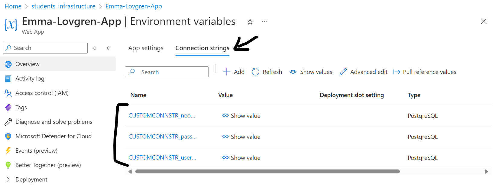
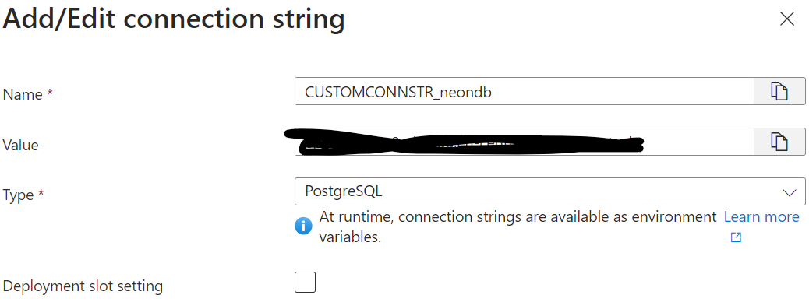

# Java Cloud - Azure - Day 2

## Learning Objectives

- Deploy a Spring App to Azure Web Services
- Deploy a Spring App with a Database Connection
- Connect a Spring App to an Azure Database
- Add a React App that talks to the Spring App
- Deploy the React App to Azure as well

## Configuring the Spring App

Follow the instructions here: [https://learn.microsoft.com/en-us/azure/app-service/configure-language-java-deploy-run?tabs=linux&pivots=java-javase](https://learn.microsoft.com/en-us/azure/app-service/configure-language-java-deploy-run?tabs=linux&pivots=java-javase) selecting the options for Java SE.

Make sure you run the following in your terminal and log in to the correct Azure account.

```bash
az login
```

Add the following to the `plugins` section at the top of your `build.gradle` file:

```groovy
id 'com.microsoft.azure.azurewebapp' version '1.10.0'
```

The configuration looks something like this (replace all angle bracket parts with actual values) at the bottom of your `build.gradle` file:

```groovy
azurewebapp {
	subscription = '<Insert Subscription Here>'
	resourceGroup = 'students_infrastructure'
	appName = '<App Name Goes Here>'
	pricingTier = 'F1'
	region = 'northeurope'
	appServicePlanName = 'ASP-studentsinfrastructure-a6a0'
	runtime {
		os = 'Linux'
		webContainer = 'Java SE' // or 'Java SE' if you want to run an executable jar
		javaVersion = 'Java 21'
	}
	appSettings {
		alwaysOn = "off"
	}
	auth {
		type = 'azure_cli' // support azure_cli, oauth2, device_code and service_principal
	}
}
```

Then run the following command in the terminal:

```bash
./gradlew azureWebAppDeploy
```

This should deploy the application to Azure.

## Deliverables

The steps to work on today are as follows:

- Deploy a Spring App without a database - the joke machine or the counter app are simple enough.
- Deploy a Spring App that already works that connects to a Neon Database.
- Change the application.yml file to read the database connection details from the Environment Variables section of Azure
- Investigate replacing the Neon Database with an Azure Database (you may need to make sure they both live on the same Network Group)
- Investigate how to deploy a React Frontend to Azure and have it talk to your Backend application
  
### Core

- Deploy your Backend application to Azure but have it using a Neon Database

### Extension

- Deploy a React Frontend for your application to Azure and have the two parts talking to each other
- Make the Backend talk to an Azure postgres database

Screenshot each stage and add them into here so that you can evidence completing the steps necessary


# Submission

### Set up Web App on Azure
1. Got the Subscription Key from Azure.

The code for the backend and the configuration is in the repo for Azure Day 1.
2. Added `id "com.microsoft.azure.azurewebapp" version "1.10.0"` under `Plugin` in `build.gradle
3. Added the following to `build.gradle`
```
azurewebapp {
	subscription = '<your subscription id>'
        resourceGroup = 'students_infrastructure'
	appName = 'Emma-Lovgren-App'
	appServicePlanName = 'ASP-studentsinfrastructure-a6a0'
	pricingTier = 'B3'
	region = 'northeurope'
	runtime {
		os = 'Linux'
		webContainer = 'Java SE' // 'Java SE' if you want to run an executable jar
		javaVersion = 'Java 21'
	}
	appSettings {
		alwaysOn = "off"
	}
	auth {
		type = 'azure_cli' // support azure_cli, oauth2, device_code and service_principal
	}
}
```
4. Run `az login` and `./gradlew azureWebAppDeploy`
5. After a couple of attempts and timeouts, Build finally succesfull:

6. Checked if the endpoint worked in the browser:


### Change application.yml and add Environment Variables to Azure

NOTE: I didn't get the below to work, so I reversed it into the old version of the application.yml file with no variables, on teacher recommendation.  

1. Replace the db configurations for the spring part with variable names, for example:
```
spring:
  datasource:
    url: jdbc:postgresql://${CUSTOMCONNSTR_neondb}:5432/neondb
    username: ${CUSTOMCONNSTR_usernamedb}
    password: ${CUSTOMCONNSTR_passworddb}
    hikari:
      maximum-pool-size: 3
      minimum-idle: 3
  jpa:
    hibernate:
      ddl-auto: update
    properties:
      hibernate:
        dialect: org.hibernate.dialect.PostgreSQLDialect
        format_sql: true
    show-sql: true 
```
2. Go to Home/students_infrastructure/Emma-Lovgren-App.
2. Go to Settings/Environment variables.
3. Go to the `Connection strings` tab, and add the variable names and corresponding values, set the type to Postgres:


